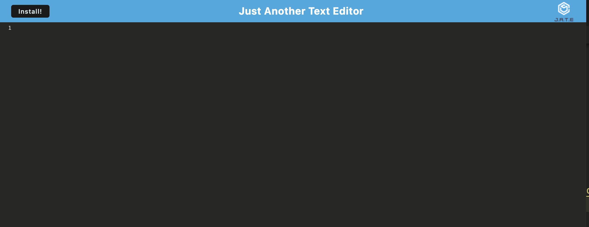
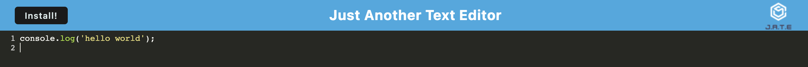
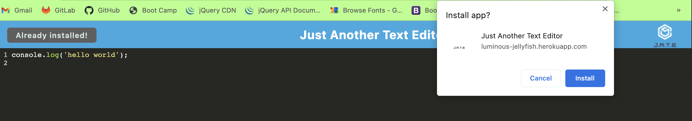
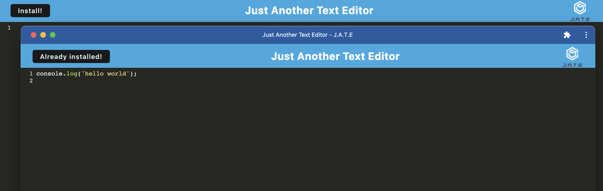

# Luminous Jellyfish Text Editor


## Table of Contents
- [Project Description](#description)
- [Installation](#installation)
- [Usage](#usage)
- [Contributions](#contributions)
- [Questions](#questions)
- [License](#license)

## Description
This app is a text editor that runs in the browser. The app is a single-page app that meets the PWA criteria and features a number of data persistence techniques that serve as redundancy in case one of the options is not supported by the browser. The app functions offline, utilizes IndexedDB, and is deployed using Heroku.

## Installation
1. Download the source code.
2. Open up the command line and run `npm install`.
3. In the command line, run `npm run start` to start the project.
4. Start coding and/or taking notes!

## Usage
[Text Editor - Heroku link](https://luminous-jellyfish.herokuapp.com/)

The following image shows the home page or landing page of the text editing app.



Below is the User Story highlighting the reasons why this app is needed. 

User Story:
```md
AS A developer
I WANT to create notes or code snippets with or without an internet connection
SO THAT I can reliably retrieve them for later use
``` 


This text editor app allows the user to create notes or code snippets. The user also has the ability to install the app locally for offline use.




## Contributions
This app was created in conjuction with the coding boot camp program at the University of Kansas. Please contact me, Rebecca, directly for guidelines.
- [Rebecca Lehew](https://github.com/rebeccalehew)

## License
Licensed under the [MIT](https://opensource.org/licenses/MIT) license.
